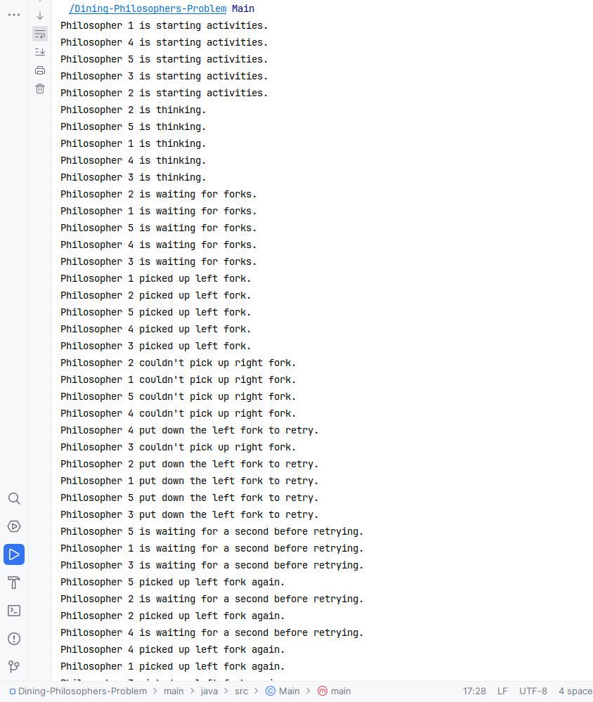
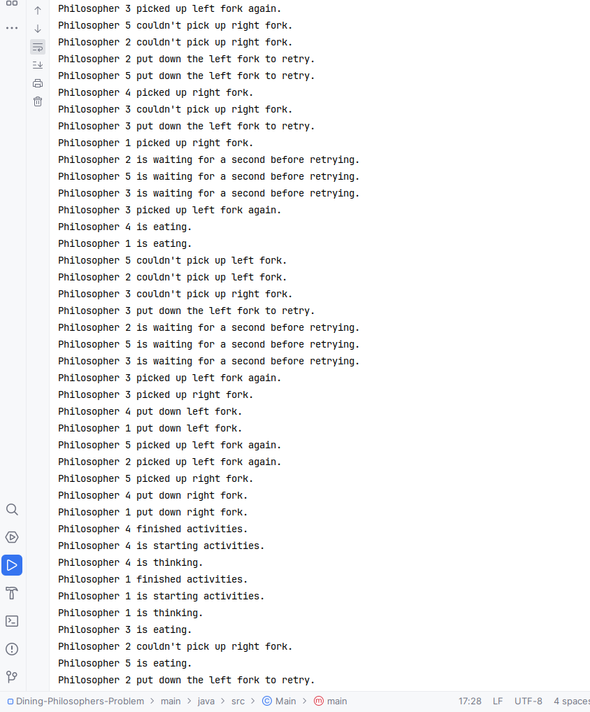
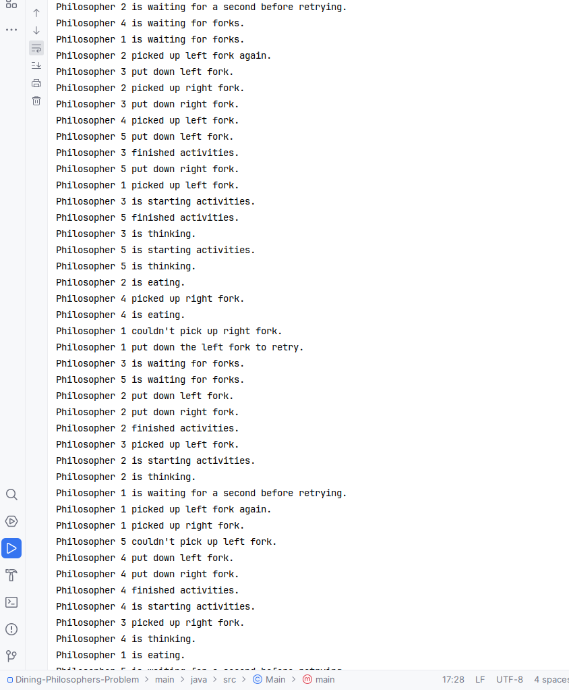
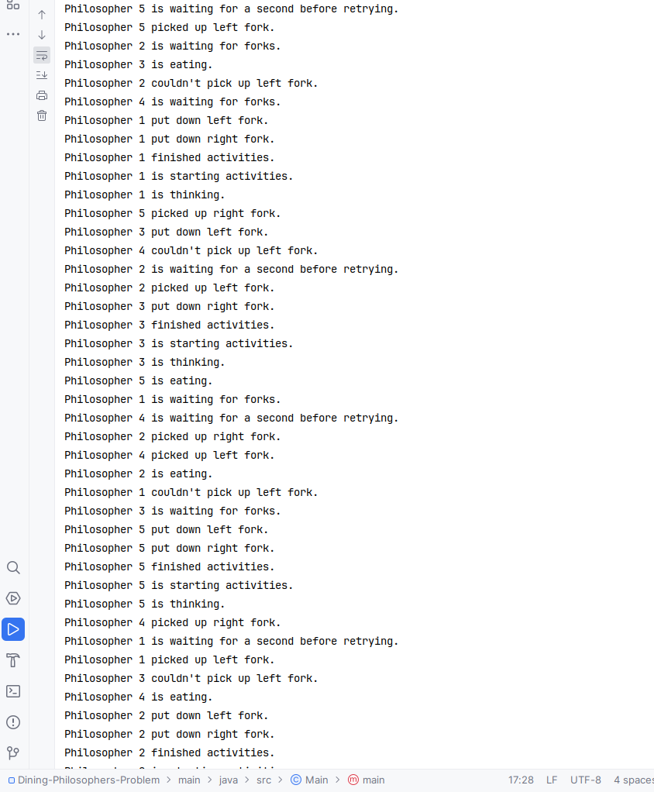
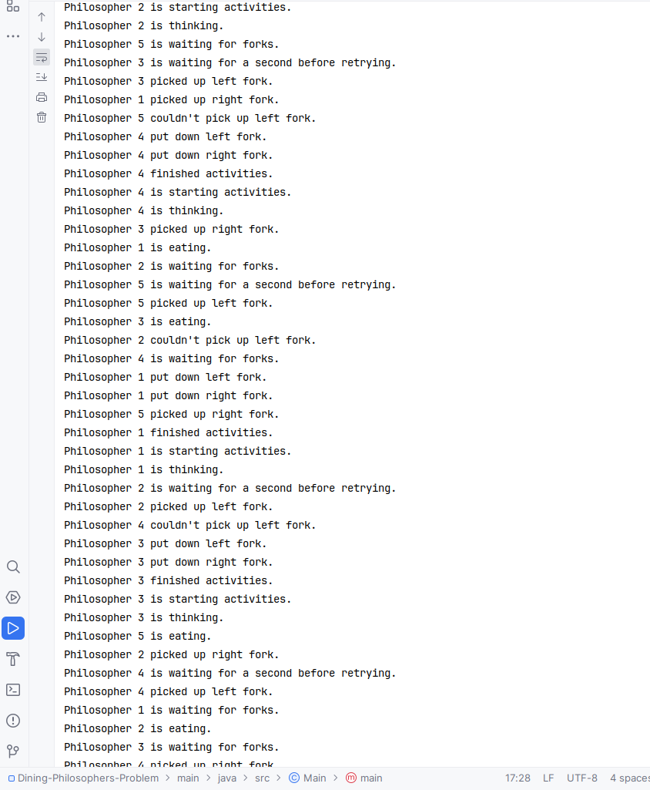
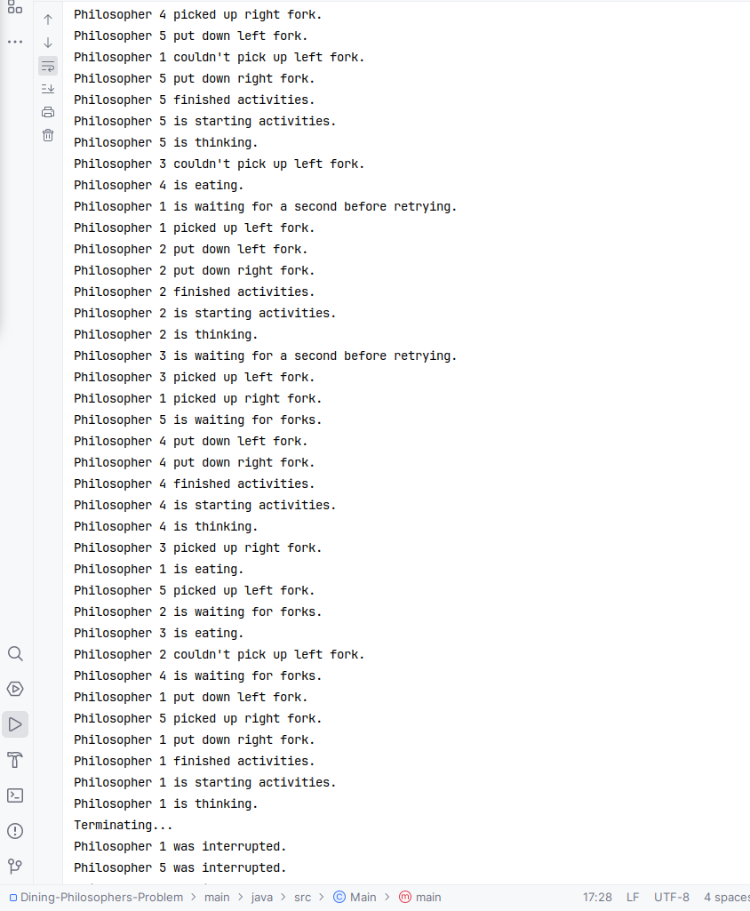
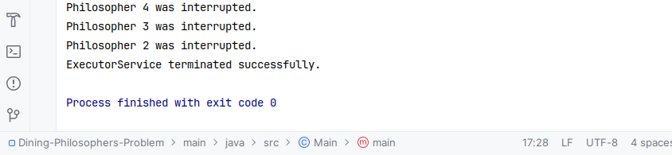

# Dining-Philosophers-Problem-Concurrency-Problem-multi-threading
My assignment about concurrency problem and synchronization(multi-threading) with Dinging Philosophers Problem for my online java course.
My source code: main -> java 
My result is at the end in this page.

---

### Assignment: Dining Philosophers with Priority

#### Background
The Dining Philosophers problem is a classic synchronization problem that demonstrates the challenges of avoiding deadlock while managing limited resources. The problem consists of five philosophers sitting at a round table, where each philosopher thinks and occasionally gets hungry and needs to eat. Between each pair of philosophers, there is a single fork. In order to eat, a philosopher must have both forks, one from their left and one from their right.

#### Task
Your assignment is to implement a solution to the Dining Philosophers problem using Java's concurrency API, with an added twist: each philosopher has a priority level that determines how urgently they need to eat. Philosophers with higher priority should be given preference when forks are available.

#### Requirements
1. Create a class `Philosopher` that implements `Runnable` and represents a philosopher with a priority level.
2. Create a class `Fork` that represents a fork. Ensure that only one philosopher can hold a fork at a time.
3. Implement logic in the `Philosopher` class to pick up both forks, eat for a certain amount of time, and then put down the forks.
4. Use an `ExecutorService` with a fixed thread pool to manage the philosopher threads.
5. Set the priority of each philosopher thread based on their priority level.
6. Ensure that your implementation avoids deadlock and starvation. Philosophers with higher priority should have a higher chance of eating first, but lower-priority philosophers should not starve.
7. Print messages to the console when a philosopher is thinking, waiting for forks, eating, and putting down forks.

#### Sample Output
```
Philosopher 1 is thinking.
Philosopher 2 is waiting for forks.
Philosopher 3 is eating.
Philosopher 1 is waiting for forks.
Philosopher 3 has finished eating and put down forks.
...
```

#### Tips
- Use `synchronized` blocks or `ReentrantLock` to manage access to the forks.
- Consider using `tryLock()` with a timeout to avoid deadlock.
- Use `Thread.sleep()` to simulate the time spent thinking and eating.
- You may need to implement additional logic to manage philosopher priorities and ensure fairness.

#### Additional Challenge
As an additional challenge, implement a "conductor" or "mediator" that controls access to the forks, ensuring that philosophers with higher priority are given preference, but also ensuring that all philosophers eventually get to eat.

This assignment will help students understand how to apply thread priorities in a more complex synchronization scenario. It will also reinforce concepts such as deadlock avoidance, resource management, and fair scheduling.


---

## Result

There was a gap in two philosophers action, and I tried with semaphores as well.
But I researched about the problem I was having and decided to accept the issue and went back to use ReentrantLock(since my assignment indicate me to use ReentrantLock or Synchronized).
For example, Philosopher 3 picked up the left fork again before Philosopher 4 put down the right fork in the message of the console. 
But I read this kind of scenario is possible in concurrent programs due to the nature of thread scheduling and the fine-grained timing involved. 
It doesn't necessarily indicate an error in the program logic.
In a concurrent environment, the order of execution between threads can be influenced by factors such as thread priorities, system load, and the specific behavior of JVM. 
The output might be a result of the slight time difference in the actions of the two philosophers.
(Or it might be logically wrong. If you notice some logical issues or mistakes, happy to hear from you.)















## Resources

These resources helped me understand to finish this assignment.

- https://www.baeldung.com/java-dining-philoshophers (Java Dining Philosophers)
- https://www.datasciencecentral.com/developing-multi-threaded-applications-with-java-concurrency-api/#:~:text=Java%20Concurrency%20API%20is%20a,and%20parallel%20code%20in%20Java. (Developing Multi-Threaded Applications with Java Concurrency API)
- https://www.baeldung.com/java-binary-semaphore-vs-reentrant-lock (Java Binary Semaphore vs Reentrant Lock)
- https://leon-wtf.github.io/doc/java-concurrency-in-practice.pdf (Java Concurrency in Practice by Brian Goetz)
- Head First Java 3rd Edition: threads/racing condition and immutable data